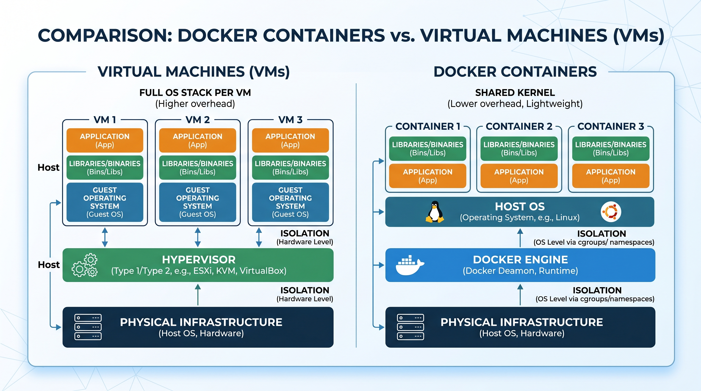

# Máquinas Virtuales vs Contenedores

Tanto las máquinas virtuales (VMs) como los contenedores son tecnologías diseñadas para ejecutar aplicaciones en entornos aislados, pero difieren fundamentalmente en su **arquitectura general** y su **relación con el sistema operativo anfitrión** (*Host OS*). Una VM emula hardware completo mediante un *Hypervisor*, requiriendo instalar un sistema operativo invitado (*Guest OS*) completo para cada instancia. Por otro lado, un contenedor es una unidad mucho más ligera que comparte el *Kernel* del *Host OS*, empaquetando únicamente la aplicación y sus dependencias necesarias para ejecutarse, sin necesidad de un *Guest OS* propio.

***Kernel***: El kernel es el núcleo del sistema operativo, es el encargado de gestionar los recursos del sistema y proporcionar una interfaz entre el hardware y el software. Es la capa más baja del sistema operativo, por lo que es el componente más crítico del sistema operativo.

Esta diferencia arquitectónica impacta directamente en el **uso de recursos** y el **tiempo de arranque** (*boot time*). Las VMs consumen considerablemente más memoria RAM, CPU y almacenamiento debido al *overhead* que genera ejecutar un sistema operativo completo por instancia, y su tiempo de arranque puede tomar desde varios segundos hasta minutos. Por otro lado, los contenedores son mucho más eficientes. Al compartir el *Kernel* del host, consumen una fracción de los recursos y pueden arrancar en milisegundos, lo que los hace ideales para entornos ágiles y arquitecturas de *Microservices*. A pesar de esto, las VMs ofrecen un nivel de aislamiento (*Isolation*) más profundo a nivel de hardware, lo que las hace más seguras en entornos *multi-tenant* y permite ejecutar diferentes sistemas operativos en el mismo *hardware* físico. 

## Ventajas y Desventajas

### Máquinas Virtuales (VMs)

**Ventajas:**
- **Strong Isolation (Aislamiento fuerte):** Al simular hardware completo, ofrecen un nivel de seguridad superior.
- **OS Flexibility:** Permiten ejecutar *Guest OS* completamente distintos al *Host OS* (Linux sobre un host Windows).

**Desventajas:**
- **Alto Resource Overhead:** Requieren reservar grandes cantidades de CPU, RAM y almacenamiento para cada *Guest OS*.
- **Slow Boot Time:** Iniciar una VM toma mucho más tiempo al tener que cargar el *Guest OS* completo.

### Contenedores

**Ventajas:**
- **Ligereza y Eficiencia:** Consumen mínimos recursos al no requerir un *Guest OS* y compartir el *Kernel* del anfitrión.
- **Arranque casi instantáneo:** Al iniciar solo el proceso de la aplicación, su *boot time* es de fracciones de segundo.
- **Alta Portabilidad:** Garantizan que la aplicación funcione de manera idéntica en entornos de *Dev, Test y Prod*.

**Desventajas:**
- **Weaker Isolation:** Al compartir el *Kernel* del *Host OS*, representan un mayor riesgo si este nivel se ve comprometido.
- **Kernel Dependency:** Deben ser compatibles con el núcleo del *Host OS* (contenedores Linux nativos requieren un entorno de host Linux).

## Docker vs VMs

## Evidencias y Código Fuente

> **Nota:** Las evidencias solicitadas para este laboratorio, así como el código de la aplicación en Spring, se encuentran dentro del siguiente repositorio de GitHub:
> 
> 🔗 [Repositorio: Programacion-Web-2](https://github.com/xJDevs/Programacion-Web-2)
